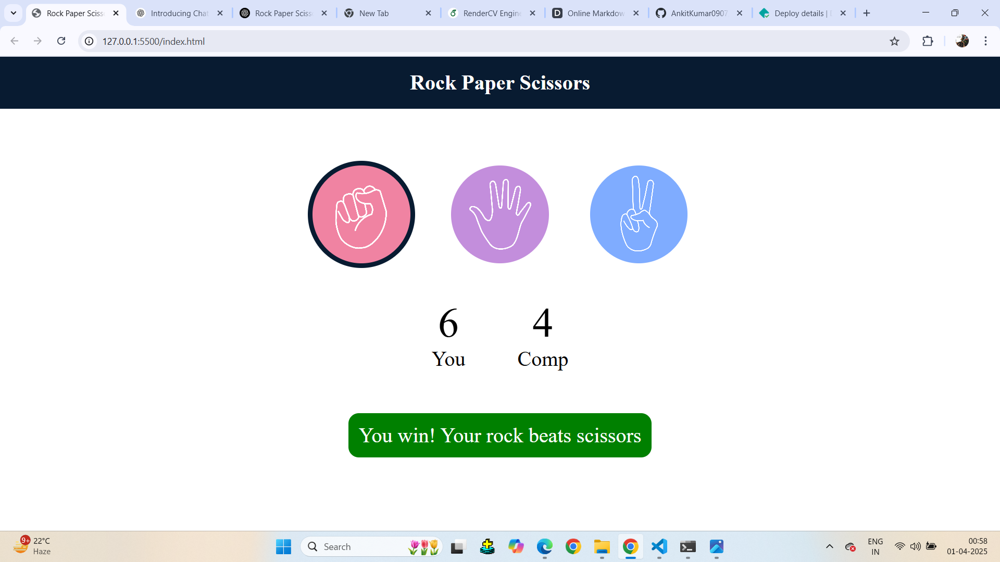
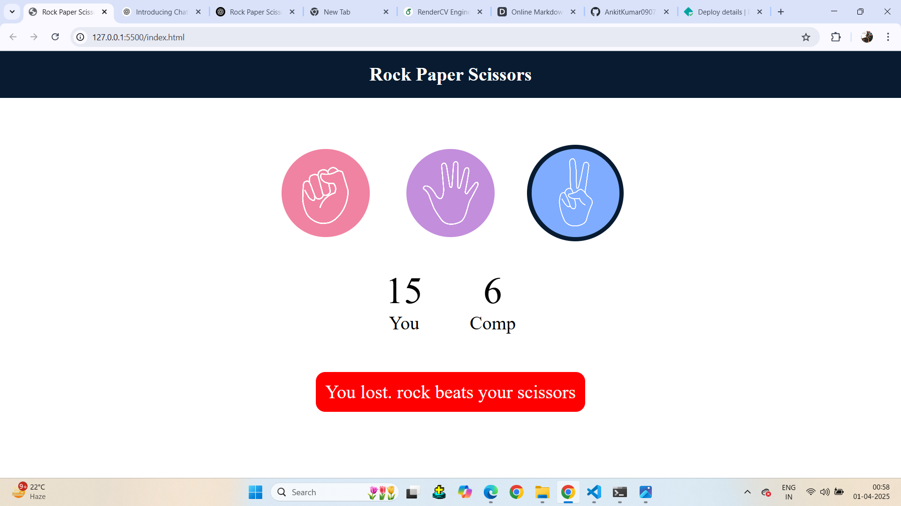

---
✊✋✌️ Rock-Paper-Scissors Game

🎮 Overview
The Rock-Paper-Scissors game is a classic hand game played between a user and a computer. This project provides an interactive and fun way to test your luck and strategy against an AI opponent.

🔹 Simple yet engaging gameplay
🔹 Score tracking system
🔹 User-friendly interface

📷 Project Images
🎨 Main Menu

🕹️ Gameplay

🏆 Results Screen

🚀 Features
✅ Classic Rock-Paper-Scissors rules
✅ Clean and intuitive UI
✅ Score tracking for multiple rounds
✅ Responsive design (for web-based versions)

🛠️ Installation
🔹 Clone the Repository
bash
Copy
git clone https://github.com/AnkitKumar0907/Rock-Paper-Scissors-Game.git
cd rock-paper-scissors
:

If Web-based:
pen index.html in your browser

🎨 How to Play
1️⃣ Choose Rock, Paper, or Scissors
3️⃣ Game result is displayed:

✊ Rock beats Scissors ✂️

✂️ Scissors beats Paper 📄

📄 Paper beats Rock ✊
4️⃣ Score is updated, and you can play again!

🔧 Technologies Used

🎨 HTML & CSS & JavaScript (for UI, if web-based)
🎲 Random Module (for AI logic)

## 📷 Project Images  

### 🎨 Main Menu  
  

### 🕹️ Gameplay  
.png)  

### 🏆 Results Screen  
  

